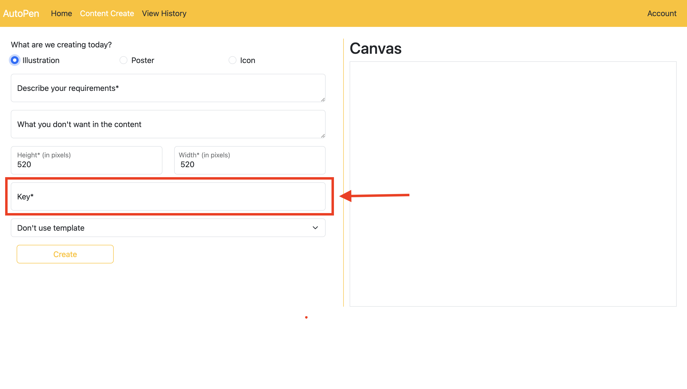

# AutoPen -- An intelligent image & text generator.

AutoPen is your go-to tool for effortless content creation. Whether you're a novelist looking for inspiration, a social
media enthusiast aiming to enhance your posts, or anyone in between, AutoPen simplifies the creative process. With just
a few clicks, generate compelling text and eye-catching images tailored to your needs. Say goodbye to writer's block and
design struggles – AutoPen has got you covered. It's the everyday creator's best friend, making content creation as easy
as it should be.

## Frontend and Backend Deployment

You can refer to the files in the `FrontEnd` and `Backend` folder to deploy our project.

[Frontend Deployment file](FrontEnd/README.md)  
[Backend Deployment file](Backend/README.md)

## Example

We already deployed a complete service on a cloud vm to show our project implementation. You can click the address below
or copy the ip address to browse.

- AutoPen

  [Project implementation deployed on cloud vm.](http://40.76.249.160:80/)

```
    http://40.76.249.160:80
```

You can use username `creator` and password `creator` to log in a pre-defined creator account to create content and
submit them for audition. The pre-defined creator account contains content creation history that will allow you to get
a quick overview of the system.

For content creation, a stable diffusion API key is required.

You can use the API key `mO7lX9FyEUQX0YgCrd4u5eXA0R4yRoxdAOrSuP0ea8DrVzKGx4rHfYQEWIuW`, but keep in mind that
there is a monthly limit on the API key. If the monthly limit of an API key has been reached, you need to use a new
API key. You can apply for a new API key at <a href="https://stablediffusionapi.com/">Stable Diffusion API</a>.

Also, please be reminded that the external stable diffusion API is unstable, sometimes content creation will encounter
error and you have to try again.

You can use username `supervisor` and password `supervisor` to log in a pre-defined supervisor account to audit content
and create template. Like the pre-defined creator account, the pre-defined supervisor account allows you to get a quick overview of the functions.

- Documentation Service

  [Documentation service deployed on cloud vm.](http://40.76.249.160:8001/)

  You can use username `test` and password `test` to login documentation service where parts of our project API are
  displayed.

```
    http://40.76.249.160:8001
```